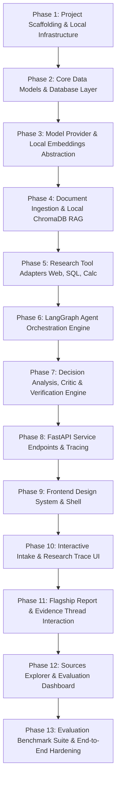

# DecisionAI — Atomic Project Todo List & Execution Plan

This project plan translates the **PRD**, **Design Document**, and **Tech Stack Architecture** for **DecisionAI (DecisionLens)** into a strictly sequential, atomic, and dependency-ordered execution roadmap.

Each task is designed to be **atomic** (one self-contained unit of work at a time), **fully testable** before proceeding to the next, and built with a **local-first / low-API dependency principle** (supporting mock/offline testing and local models/embeddings so development can run at ₹0 cost with high test coverage and zero flaky bugs).

---

---

## Phase 1: Project Scaffolding & Local Infrastructure

### Task 1.1: Initialize Monorepo Directory Structure & Configuration
- **Objective:** Establish the clean monorepo file structure separating backend, frontend, data fixtures, and docker infrastructure.
- **Files to create:**
  - `backend/app/__init__.py`, `backend/app/main.py`, `backend/app/config.py`
  - `backend/tests/__init__.py`, `backend/tests/conftest.py`
  - `.env.example`, `.gitignore`, `pyproject.toml` (or `requirements.txt` with Ruff, pytest, FastAPI, Pydantic v2, SQLAlchemy)
  - `data/sample_documents/`, `data/evaluation/`
- **Minimal API Footprint:** 100% local. Zero external API calls.
- **Verification / Test:**
  - Run `pytest backend/tests` to verify test suite runner initialization.
  - Verify environment loader reads `.env` defaults safely without raising unhandled exceptions.

### Task 1.2: Container & Local Infrastructure Setup
- **Objective:** Create lightweight Docker Compose and local SQLite/PostgreSQL configuration for development.
- **Files to create:**
  - `infra/docker-compose.yml` (PostgreSQL, ChromaDB local services)
  - `backend/app/database/session.py` (SQLAlchemy async engine with automatic fallback to local `sqlite+aiosqlite:///./decisionai.db` if PostgreSQL is not running)
- **Minimal API Footprint:** 100% local database and vector storage.
- **Verification / Test:**
  - Run `pytest backend/tests/test_db_connection.py` ensuring database engine initializes and creates session successfully on both SQLite and PostgreSQL.

---

## Phase 2: Core Data Schemas & Database Layer

### Task 2.1: Define Core Pydantic Domain Schemas
- **Objective:** Establish type-safe domain schemas for decisions, research plans, evidence, claims, critique, and the 14-part decision report.
- **Files to create:**
  - `backend/app/schemas/decision.py` (Intake context, constraints, alternatives)
  - `backend/app/schemas/research.py` (Research tasks, TaskStatus enum, TaskType enum)
  - `backend/app/schemas/evidence.py` (Source metadata, EvidenceItem, SourceType enum)
  - `backend/app/schemas/claim.py` (ClaimItem, VerificationStatus enum: `SUPPORTED`, `PARTIALLY_SUPPORTED`, `UNSUPPORTED`, `CONTRADICTED`)
  - `backend/app/schemas/report.py` (Complete 14-part DecisionReport schema with 4 UI bands)
- **Minimal API Footprint:** 100% in-memory data modeling.
- **Verification / Test:**
  - Unit test `backend/tests/test_schemas.py` validating schema serialization, field validations, and default values.

### Task 2.2: Implement SQLAlchemy Database ORM Models
- **Objective:** Implement persistent relational models for research runs, tasks, sources, claims, and evaluation records.
- **Files to create:**
  - `backend/app/database/models.py` (`ResearchRun`, `ResearchTask`, `SourceRecord`, `ClaimRecord`, `EvaluationRunRecord`)
  - `backend/app/database/crud.py` (Async CRUD helper functions for creating/updating runs and logging task states)
- **Minimal API Footprint:** 100% local database operations.
- **Verification / Test:**
  - Run `pytest backend/tests/test_crud.py` creating a mock research run, inserting tasks, attaching sources, and retrieving the full run hierarchy.

---

## Phase 3: Model Provider & Local Embeddings Abstraction

### Task 3.1: Build Pluggable LLM Provider Abstraction
- **Objective:** Create a provider-agnostic LLM interface supporting OpenAI-compatible APIs, Gemini, NVIDIA, Ollama, and a deterministic Mock Provider for zero-cost offline testing.
- **Files to create:**
  - `backend/app/models/llm_base.py` (`LLMProvider` Protocol, `LLMRequest`, `LLMResponse`)
  - `backend/app/models/mock_provider.py` (Deterministic mock responses for offline dev & CI)
  - `backend/app/models/gemini_provider.py` (Google Gemini API adapter)
  - `backend/app/models/openai_provider.py` (OpenAI / NVIDIA API adapter)
  - `backend/app/models/factory.py` (Factory selector driven by `LLM_PROVIDER` in settings)
- **Minimal API Footprint:** Includes `MockLLMProvider` enabling 100% free, deterministic offline unit testing.
- **Verification / Test:**
  - Run `pytest backend/tests/test_llm_providers.py` verifying structured output generation using both `MockProvider` and live API (if key present).

### Task 3.2: Implement Local Embedding Service & Token Counter
- **Objective:** Implement local sentence-transformers embeddings (`all-MiniLM-L6-v2`) and local token/cost estimator.
- **Files to create:**
  - `backend/app/retrieval/embeddings.py` (Local HuggingFace/SentenceTransformers with fast deterministic fallback)
  - `backend/app/observability/cost_tracker.py` (Token counter and cost calculator for token tracking)
- **Minimal API Footprint:** 100% local CPU embedding inference with zero API cost.
- **Verification / Test:**
  - Run `pytest backend/tests/test_embeddings.py` verifying embedding dimension (e.g. 384-dim), cosine similarity accuracy, and cost tracking logic.

---

## Phase 4: Document Ingestion & Local ChromaDB RAG

### Task 4.1: Build Document Parsing & Chunking Pipeline
- **Objective:** Extract and chunk content from PDFs (PyMuPDF), Markdown, and Plain Text files with metadata enrichment.
- **Files to create:**
  - `backend/app/retrieval/parser.py` (PyMuPDF PDF text extractor, Markdown/TXT loader, chunker with configurable chunk size and overlap)
- **Minimal API Footprint:** 100% local processing.
- **Verification / Test:**
  - Run `pytest backend/tests/test_parser.py` using sample PDF and Markdown files in `data/sample_documents/` ensuring accurate text extraction and chunk metadata (page number, section).

### Task 4.2: Implement Local ChromaDB Vector Store Manager
- **Objective:** Store document chunks in local ChromaDB with metadata filtering (workspace_id, document_id, source_type).
- **Files to create:**
  - `backend/app/retrieval/vector_store.py` (ChromaDB collection manager, indexing methods, semantic retrieval top-k query)
- **Minimal API Footprint:** 100% local embedded ChromaDB storage.
- **Verification / Test:**
  - Run `pytest backend/tests/test_vector_store.py` indexing sample documents, performing similarity search, and asserting recall of expected passages.

---

## Phase 5: Research Tool Adapters (Web, SQL, Calculation)

### Task 5.1: Implement Local Safe SQL Tool
- **Objective:** Create a secure, read-only SQL tool with AST/regex query validation and result sanitization.
- **Files to create:**
  - `backend/app/tools/sql_tool.py` (Read-only execution against SQLite/PostgreSQL, block destructive keywords like DROP/UPDATE/DELETE/ALTER, query row limits, timeout)
  - `data/sample_benchmark.db` (Sample structured database with benchmark metrics for technology comparison)
- **Minimal API Footprint:** 100% local database querying.
- **Verification / Test:**
  - Run `pytest backend/tests/test_sql_tool.py` verifying that SELECT queries execute safely and return structured rows, while mutation queries (INSERT/DROP) are rejected with validation errors.

### Task 5.2: Implement Quantitative Calculation Tool
- **Objective:** Safe mathematical expression evaluator for quantitative decision trade-offs (costs, QPS, latency, storage sizing).
- **Files to create:**
  - `backend/app/tools/calc_tool.py` (Sandboxed AST-based mathematical evaluation tool)
- **Minimal API Footprint:** 100% local calculation engine.
- **Verification / Test:**
  - Run `pytest backend/tests/test_calc_tool.py` verifying math computations (e.g. `(100000 * 1536 * 4) / (1024 * 1024)`) and blocking malicious code execution.

### Task 5.3: Implement Web Research Adapter with Offline Mock Fallback
- **Objective:** Create a web search adapter (DuckDuckGo / Tavily) with automatic local cache and offline fixture mode to minimize API dependency.
- **Files to create:**
  - `backend/app/tools/web_tool.py` (Search adapter with query deduplication, snippet extraction, and cached offline results fallback)
- **Minimal API Footprint:** Uses free DuckDuckGo search or local offline mock search fixtures when no external API key is provided.
- **Verification / Test:**
  - Run `pytest backend/tests/test_web_tool.py` verifying search results formatting, source metadata parsing, and offline cache behavior.

---

## Phase 6: LangGraph Agent Orchestration Engine

### Task 6.1: Define LangGraph Agent State & Graph Structure
- **Objective:** Define the complete typed state machine for LangGraph with conditional branches, loops, and retry thresholds.
- **Files to create:**
  - `backend/app/agents/state.py` (`DecisionAgentState` schema holding parsed inputs, tasks, evidence pool, critic feedback, and report)
  - `backend/app/agents/graph.py` (LangGraph graph builder connecting nodes and defining conditional routing)
- **Minimal API Footprint:** Graph orchestration structure only.
- **Verification / Test:**
  - Run `pytest backend/tests/test_agent_state.py` asserting state initialization, transitions, and state immutability.

### Task 6.2: Implement Decision Parser & Research Planner Nodes
- **Objective:** Build nodes that parse user questions into objectives/constraints and decompose them into prioritized research tasks.
- **Files to create:**
  - `backend/app/agents/parser_node.py` (Extracts decision objective, candidate alternatives, constraints, evaluation criteria)
  - `backend/app/agents/planner_node.py` (Generates atomic research tasks targeting Web, RAG, SQL, or Calculation)
- **Minimal API Footprint:** Supports mock structured LLM responses for test runs.
- **Verification / Test:**
  - Run `pytest backend/tests/test_planner_node.py` with sample decision prompts, verifying structured task generation.

### Task 6.3: Implement Tool Router & Evidence Aggregator Node
- **Objective:** Dispatch research tasks to appropriate tools (Web, Document RAG, SQL, Calculation), merge findings into the Evidence Pool, and evaluate evidence sufficiency.
- **Files to create:**
  - `backend/app/agents/executor_node.py` (Parallel/sequential task dispatcher)
  - `backend/app/agents/merge_node.py` (Evidence deduplication, indexing into unified Evidence Pool)
  - `backend/app/agents/sufficiency_edge.py` (Conditional edge: if evidence is insufficient and loop count < max_loops, route back to Planner; else route to Analysis)
- **Minimal API Footprint:** Local tool executions and memory pooling.
- **Verification / Test:**
  - Run `pytest backend/tests/test_executor_node.py` verifying tool invocation, evidence deduplication, and loop-termination guardrails.

---

## Phase 7: Decision Analysis, Critic & Verification Engine

### Task 7.1: Implement Decision Analysis Agent Node
- **Objective:** Synthesize evidence across alternatives to generate an initial structured recommendation, trade-off matrix, assumptions, and confidence score.
- **Files to create:**
  - `backend/app/agents/analysis_node.py` (Evaluates criteria, builds comparison matrix, drafts initial recommendation with assumptions)
- **Minimal API Footprint:** Structured LLM generation.
- **Verification / Test:**
  - Run `pytest backend/tests/test_analysis_node.py` ensuring the analysis output contains all mandatory fields (alternatives, criteria, trade-offs, confidence).

### Task 7.2: Implement Critic Agent Node
- **Objective:** Actively challenge the initial recommendation by looking for contradictions, missing evidence, ungrounded assumptions, and generating "What would change this recommendation?".
- **Files to create:**
  - `backend/app/agents/critic_node.py` (Adversarial critique generator, identifies counterarguments, risks, and stress-tests assumptions)
- **Minimal API Footprint:** Structured LLM generation.
- **Verification / Test:**
  - Run `pytest backend/tests/test_critic_node.py` asserting that critique identifies weak assumptions and populates counterarguments.

### Task 7.3: Implement Evidence & Citation Verifier Node
- **Objective:** Verify every factual claim against the evidence pool, classify support level (`SUPPORTED`, `PARTIALLY_SUPPORTED`, `UNSUPPORTED`, `CONTRADICTED`), and produce the final verified report.
- **Files to create:**
  - `backend/app/agents/verifier_node.py` (Sentence-level claim extraction, evidence alignment check, unsupported-claim flagger)
  - `backend/app/agents/report_node.py` (Assembles the full 14-section, 4-band Decision Report)
- **Minimal API Footprint:** Algorithmic + LLM verification with deterministic offline checks.
- **Verification / Test:**
  - Run `pytest backend/tests/test_verifier_node.py` asserting that supported claims link to valid source IDs and ungrounded claims are flagged as `UNSUPPORTED`.

---

## Phase 8: FastAPI Service Endpoints & Tracing

### Task 8.1: Implement REST API Endpoints & Request Handlers
- **Objective:** Expose clean endpoints for creating research runs, streaming/polling status, retrieving traces, and managing documents.
- **Files to create:**
  - `backend/app/api/routes_research.py` (`POST /api/v1/research`, `GET /api/v1/research/{id}`, `GET /api/v1/research/{id}/trace`, `GET /api/v1/research/{id}/evidence`)
  - `backend/app/api/routes_documents.py` (`POST /api/v1/documents`, `GET /api/v1/documents`)
  - `backend/app/api/routes_health.py` (`GET /health`)
- **Minimal API Footprint:** Local FastAPI endpoints.
- **Verification / Test:**
  - Run `pytest backend/tests/test_api_routes.py` using `httpx.AsyncClient` verifying all endpoints return correct status codes and JSON structures.

### Task 8.2: Implement Execution Tracing & Observability Logger
- **Objective:** Record step-by-step agent graph transitions, tool invocations, token usage, latencies, and errors for live UI inspection.
- **Files to create:**
  - `backend/app/observability/tracer.py` (Captures node execution times, input/output snapshots, tool calls, and run logs into SQLite/PostgreSQL)
- **Minimal API Footprint:** 100% local logging without requiring external cloud accounts.
- **Verification / Test:**
  - Run `pytest backend/tests/test_tracer.py` asserting that a simulated run generates accurate step-by-step trace records with timestamps.

---

## Phase 9: Frontend Design System & Shell (Next.js + Tailwind)

### Task 9.1: Initialize Next.js Project & Configure Design Tokens
- **Objective:** Set up Next.js app with Tailwind CSS enforcing the strict Design Document palette and typography.
- **Files to create/modify:**
  - `frontend/package.json`, `frontend/tailwind.config.js`
  - Color Tokens: `ink` (`#10131C`), `ink-raised` (`#181D2B`), `paper` (`#E9ECEC`), `paper-raised` (`#F5F6F5`), `evidence-teal` (`#2F8F8B`), `signal-rust` (`#C1553B`), `verified-green` (`#4C8B5B`), `attention-amber` (`#D9A441`)
  - Typography: Fraunces (serif), Inter (sans), IBM Plex Mono (mono)
  - `frontend/src/app/globals.css`, `frontend/src/app/layout.tsx`
- **Minimal API Footprint:** Frontend UI layer.
- **Verification / Test:**
  - Run `npm run build` or `npm test` verifying CSS token compilation and font imports.

### Task 9.2: Build Persistent Left Navigation Rail & Surface Controller
- **Objective:** Create the persistent sidebar navigation (`/ask`, `/runs`, `/reports`, `/evidence`, `/evaluation`) and the dynamic surface theme provider (`ink` for process vs `paper` for report).
- **Files to create:**
  - `frontend/src/components/navigation/Sidebar.tsx`
  - `frontend/src/components/common/SurfaceProvider.tsx`
  - `frontend/src/components/common/Badge.tsx`, `frontend/src/components/common/MonoTag.tsx`
- **Minimal API Footprint:** Client-side layout.
- **Verification / Test:**
  - Unit test / render test verifying sidebar navigation links and surface class toggling.

---

## Phase 10: Interactive Intake & Research Trace UI

### Task 10.1: Implement Decision Intake Screen (`/ask`)
- **Objective:** Build the paper-surface intake interface with primary question input, collapsible context panel, and document upload dropzone.
- **Files to create:**
  - `frontend/src/app/ask/page.tsx`
  - `frontend/src/components/intake/QuestionForm.tsx` (Large Fraunces serif placeholder "What are you trying to decide?")
  - `frontend/src/components/intake/ContextDrawer.tsx` (Goals, constraints, budget, timeframe, alternative chips)
  - `frontend/src/components/intake/DocumentUpload.tsx` (Drag-and-drop file uploader with type/size validation)
  - `frontend/src/components/intake/ParsedSummaryCard.tsx` (Live right-side preview of detected objective and alternatives)
- **Minimal API Footprint:** Connects to `/api/v1/research` and `/api/v1/documents`.
- **Verification / Test:**
  - Interactive test: submit sample question, verify form validation, file upload POST, and automatic redirect to `/runs/[id]`.

### Task 10.2: Implement Live Research Trace Console (`/runs/[id]`)
- **Objective:** Build the ink-surface developer console displaying the live LangGraph execution graph, tool call logs in monospace, running evidence counter, and token/cost ticker.
- **Files to create:**
  - `frontend/src/app/runs/[id]/page.tsx`
  - `frontend/src/components/trace/AgentGraphView.tsx` (Visual LangGraph nodes: Parser → Planner → Web/RAG/SQL/Calc → Merge → Analysis → Critic → Verifier → Report, with visible loop-back edge)
  - `frontend/src/components/trace/StepBuildLog.tsx` (Expandable monospace execution logs, search queries, SQL queries, timings)
  - `frontend/src/components/trace/CostTicker.tsx` (Live token count, estimated cost, and evidence count ticker)
- **Minimal API Footprint:** Polls `/api/v1/research/{id}/trace`.
- **Verification / Test:**
  - Test trace component rendering with sample run status transitions (queued -> running -> done) and verify surface shift trigger when verifier completes.

---

## Phase 11: Flagship Report & Signature Evidence Thread

### Task 11.1: Implement Structured Decision Report Page (`/runs/[id]/report`)
- **Objective:** Render the 14-part decision report structured across the 4 specified visual bands on the cool-grey `paper` surface.
- **Files to create:**
  - `frontend/src/app/runs/[id]/report/page.tsx`
  - `frontend/src/components/report/VerdictBand.tsx` (Headline recommendation in Fraunces serif, confidence indicator with mono reasoning, comparison chips)
  - `frontend/src/components/report/EvidenceBand.tsx` (Context, decision criteria, quantitative comparison matrix table, trade-offs)
  - `frontend/src/components/report/ChallengeBand.tsx` (Adversarial critic findings, risks, counterarguments, and prominent "What would change this recommendation?" block)
  - `frontend/src/components/report/TraceBand.tsx` (Collapsible audit trace and full citation bibliography)
- **Minimal API Footprint:** Connects to `/api/v1/research/{id}`.
- **Verification / Test:**
  - Verify all 4 bands render correctly with provided test report data, ensuring no missing sections or layout shifts.

### Task 11.2: Implement The Signature Evidence Thread Interaction
- **Objective:** Build interactive sentence-level claim hovering/tapping that draws an SVG connecting thread to the exact supporting source card in the evidence drawer, and highlights unsupported claims in `signal-rust`.
- **Files to create:**
  - `frontend/src/components/report/EvidenceThread.tsx` (SVG connector overlay calculating coordinates between active claim element and target source card)
  - `frontend/src/components/report/ClaimSentence.tsx` (Interactive sentence span with hover triggers, teal thread anchor, and rust "unsupported" badge)
  - `frontend/src/components/report/SourceDrawer.tsx` (Side panel / mobile bottom sheet showing source title, type, timestamp, excerpt, credibility)
- **Minimal API Footprint:** 100% client-side DOM & SVG interaction.
- **Verification / Test:**
  - Test hovering over claims with single/multiple sources to verify SVG line draws smoothly to the correct source card; verify unsupported claims render distinct rust tag.

---

## Phase 12: Sources Explorer & Evaluation Dashboard

### Task 12.1: Build Evidence & Sources Explorer Screen (`/runs/[id]/evidence`)
- **Objective:** Provide a filterable source grid allowing two-way inspection (filter by Web/Doc/SQL/Calc, click source to highlight all supported claims in report, and jump to unsupported claims).
- **Files to create:**
  - `frontend/src/app/runs/[id]/evidence/page.tsx`
  - `frontend/src/components/evidence/SourceFilterGrid.tsx` (Filter by source type, search term, and verification status)
  - `frontend/src/components/evidence/BiDirectionalInspector.tsx` (Source-to-claim reverse highlighter)
- **Minimal API Footprint:** Connects to `/api/v1/research/{id}/evidence`.
- **Verification / Test:**
  - Verify filtering by source type (e.g. "SQL" or "Document") isolates matching items and highlights linked claims.

### Task 12.2: Implement Evaluation Dashboard (`/evaluation`)
- **Objective:** Create the dense, mono-forward engineering evaluation dashboard comparing the benchmark progression across system configurations.
- **Files to create:**
  - `frontend/src/app/evaluation/page.tsx`
  - `frontend/src/components/evaluation/ProgressionTable.tsx` (Compares Baseline LLM → Basic RAG → Hybrid RAG → Agentic RAG+SQL → Agentic+Critic+Verification across Citation Coverage, Faithfulness, Relevance, Recall@5, Latency, Cost)
  - `frontend/src/components/evaluation/MetricSummaryCards.tsx` (Tabular summary of latest benchmark run)
- **Minimal API Footprint:** Connects to `/api/v1/evaluations`.
- **Verification / Test:**
  - Verify tabular metrics and progression comparisons render accurately from benchmark test results.

---

## Phase 13: Evaluation Benchmark Suite & End-to-End Hardening

### Task 13.1: Build Curated Benchmark Dataset & Offline Test Fixtures
- **Objective:** Create 50 representative technical decision questions with context, constraints, candidate alternatives, and expected verification criteria.
- **Files to create:**
  - `data/evaluation/benchmark_dataset.json` (50 benchmark cases: database selection, RAG vs fine-tuning, cloud vs self-hosted, model selection)
  - `backend/app/evaluation/metrics.py` (Faithfulness score, citation coverage %, recall@k, precision@k, consistency calculator)
- **Minimal API Footprint:** 100% local test fixtures and metric math.
- **Verification / Test:**
  - Run `pytest backend/tests/test_evaluation_metrics.py` validating automated calculation of citation coverage, groundedness score, and retrieval recall.

### Task 13.2: Implement Automated Benchmark Runner CLI & Route
- **Objective:** Build an automated runner that executes the benchmark suite across ablation stages (Baseline, RAG, Full Agentic) and records results in the database.
- **Files to create:**
  - `backend/app/evaluation/runner.py` (Evaluation runner with progress logging and metric storage)
  - `backend/app/api/routes_evaluation.py` (`POST /api/v1/evaluations/run`, `GET /api/v1/evaluations/{id}`)
  - `scripts/run_evaluation.py` (CLI entry point for running benchmarks in batch mode)
- **Minimal API Footprint:** Uses local benchmark runner with optional mock LLM or live API.
- **Verification / Test:**
  - Run `python scripts/run_evaluation.py --mock --limit 3` verifying benchmark execution, metric computation, and report persistence without network errors.

### Task 13.3: End-to-End Integration Testing & Bug Hardening
- **Objective:** Comprehensive end-to-end integration tests verifying zero-crash guarantees, graceful degradation on tool timeouts/failures, and clean build.
- **Files to create/modify:**
  - `backend/tests/test_e2e_research_flow.py` (End-to-end test simulating full user journey from question input to verified report)
  - `backend/tests/test_error_handling.py` (Test tool failure fallbacks, search timeouts, invalid SQL attempts, missing documents)
- **Minimal API Footprint:** Comprehensive automated test suite using mock providers and local fixtures.
- **Verification / Test:**
  - Run full test suite: `pytest backend/tests -v` ensuring 100% pass rate.
  - Run frontend build: `cd frontend && npm run build` ensuring clean build with zero TypeScript or lint errors.

---

## Execution Summary & Dependency Invariant

| Phase | Core Deliverable | Primary Tech | API Dependency Level | Verification Standard |
|---|---|---|---|---|
| **Phase 1** | Scaffolding & DB Engine | Python / FastAPI / SQLite / PG | None (100% Local) | Pytest passes; DB session active |
| **Phase 2** | Domain Schemas & Models | Pydantic v2 / SQLAlchemy | None (100% Local) | Schema unit tests pass |
| **Phase 3** | LLM & Embedding Layer | SentenceTransformers / Mock LLM | Low / Optional (Mock available) | Local embedding test passes |
| **Phase 4** | Document Ingestion & RAG | PyMuPDF / ChromaDB | None (100% Local) | Chunking & vector recall tests pass |
| **Phase 5** | Web, SQL & Math Tools | Python AST / DuckDuckGo / SQLite | Low (Offline search fallback) | Read-only SQL & Calc tests pass |
| **Phase 6** | LangGraph Agent Graph | LangGraph / Python 3.12 | Low / Mockable | Graph transitions & loops validated |
| **Phase 7** | Critic & Verification | LLM Prompts / Verifier Logic | Low / Mockable | Unsupported claims flagged accurately |
| **Phase 8** | FastAPI Service & Traces | FastAPI / AsyncIO | None (100% Local) | All HTTP endpoints return 200/201 |
| **Phase 9** | Frontend Design System | Next.js / Tailwind CSS | None (Client-side) | Build passes; design tokens match spec |
| **Phase 10** | Intake & Trace UI | React / Server & Client Components | Local API | Question submission & live trace work |
| **Phase 11** | Report & Evidence Thread | SVG Thread / React / CSS | Local API | Hover claim draws SVG line to source |
| **Phase 12** | Sources & Eval Dashboard | React / Lucide / Tailwind | Local API | Source filtering & benchmark tables work |
| **Phase 13** | Benchmark Suite & CI | Pytest / Ragas / Scripts | None to Low | 100% test pass; E2E flow verified |
