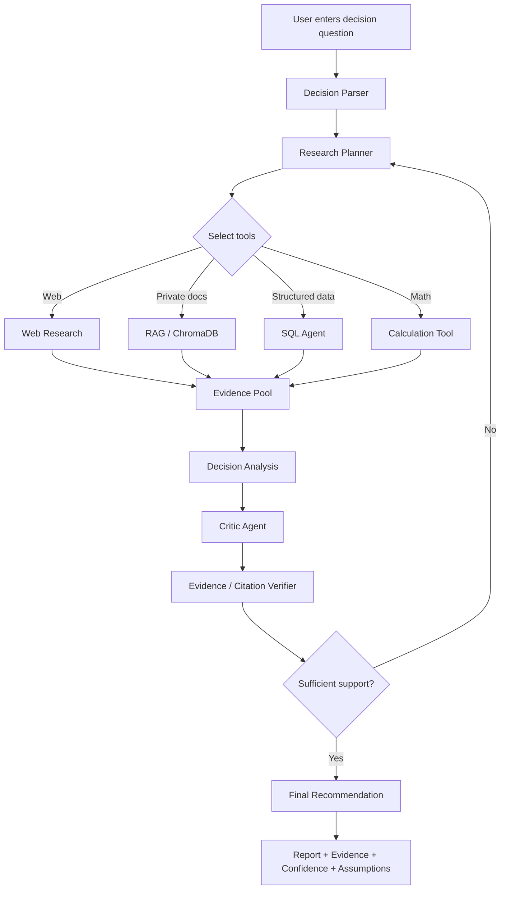

# DecisionLens — Product Requirements Document (PRD)

## 1. Product Overview

**Product name:** DecisionLens

**Working description:** An agentic AI decision-intelligence platform that researches a question, combines public web evidence with user-provided documents and structured data, performs analysis, challenges its own recommendation, and produces a traceable decision report.

DecisionLens is intentionally **not** positioned as a general-purpose AI search engine. Search/research is an input capability. The core product outcome is **evidence-based decision support for a specific context**.

### Example question

> “Should we use PostgreSQL + pgvector or PostgreSQL + ChromaDB for this application, given our expected traffic, team expertise, budget, and deployment environment?”

The system should produce a recommendation with:

- evidence and source citations
- assumptions
- quantitative comparison where applicable
- counterarguments
- confidence
- alternatives
- explanation of what could change the recommendation

---

## 2. Problem Statement

Current AI search products are excellent at finding and synthesizing public information. However, a decision often depends on more than public information:

- the user's requirements and constraints
- private documents
- structured data
- previous experiments
- quantitative calculations
- domain-specific trade-offs
- assumptions and risk tolerance

DecisionLens addresses this by combining research, retrieval, data analysis, decision reasoning, criticism, and evidence verification into one workflow.

---

## 3. Product Vision

> **Turn scattered evidence into a defensible decision.**

The long-term vision is a research and decision layer that can operate across web sources, organizational knowledge, structured databases, experiments, and user-defined constraints.

---

# 4. Goals

## 4.1 Primary Goals

1. **Generate evidence-grounded recommendations** rather than generic conversational answers.
2. **Combine heterogeneous data sources** including web research, user documents, vector search, and SQL data.
3. **Support agentic multi-step analysis** where the system decides which tools to use and in what order.
4. **Make recommendations traceable** through citations, assumptions, evidence, and confidence.
5. **Challenge recommendations** with a critic/verification stage before presenting the final answer.
6. **Measure system quality quantitatively** using a repeatable evaluation dataset.
7. **Build the system API-first and model-agnostic**, allowing different LLM providers to be swapped without redesigning the application.
8. **Keep the initial implementation affordable**, with local infrastructure and API-based model inference rather than training an LLM from scratch.

## 4.2 Secondary Goals

1. Demonstrate production-oriented GenAI engineering skills for a portfolio/resume.
2. Provide a clean UI for inspecting the research process and evidence.
3. Make research runs reproducible and observable.
4. Support future experiments with different models, retrieval strategies, and agent architectures.

## 4.3 Non-Goals for MVP

1. Building or training a foundation model from scratch.
2. Competing with Google or Perplexity on general-purpose web search quality or search-scale infrastructure.
3. Fully autonomous execution of high-impact real-world actions.
4. Providing professional legal, medical, or financial advice.
5. Perfect factuality; the MVP instead aims for measurable improvements in evidence grounding, citation correctness, and decision consistency.

---

# 5. Target Users

## Primary user

A technically capable student, engineer, researcher, founder, product manager, or analyst who needs to compare alternatives and make a decision using multiple evidence sources.

## Initial persona

**Technical Decision Maker**

Typical questions:

- Which technology should we choose?
- Which model/provider should we use?
- Should we use RAG or fine-tuning?
- Which database/architecture is better for this workload?
- Which vendor or infrastructure option fits our constraints?

---

# 6. User Stories

## 6.1 Core Research and Decision Stories

### US-01 — Ask a decision question

**As a user**, I want to describe a decision and its context so that the system can research the problem using my constraints.

**Acceptance criteria:**

- User can enter a natural-language question.
- User can optionally provide goals, constraints, budget, timeframe, and preferences.
- System identifies the decision to be made and candidate alternatives.

### US-02 — Create a research plan

**As a user**, I want the system to break my decision into research sub-questions so that the final recommendation is based on sufficient evidence.

**Acceptance criteria:**

- Planner generates explicit research tasks.
- Tasks have a purpose and expected evidence type.
- System can decide whether a task requires web search, document retrieval, SQL, or calculation.

### US-03 — Research current external information

**As a user**, I want the system to gather current external evidence so that the recommendation does not rely only on stale model knowledge.

**Acceptance criteria:**

- Research tasks can invoke a web/search tool.
- Sources are recorded with title, URL/reference, retrieval time, and relevant excerpts/metadata.
- Final claims can reference the supporting sources.

### US-04 — Use private documents

**As a user**, I want to upload documents so that the recommendation reflects information that is not publicly available.

**Acceptance criteria:**

- Documents can be ingested and indexed.
- Relevant document passages are retrieved for a research query.
- Retrieved passages can be cited in the final report.

### US-05 — Query structured data

**As a user**, I want the system to query structured data so that it can use exact values and perform calculations instead of relying only on semantic retrieval.

**Acceptance criteria:**

- Agent can generate or execute safe read-only SQL.
- Query results are visible in the research trace.
- Numerical claims can reference the underlying result.

### US-06 — Compare alternatives

**As a user**, I want alternatives compared against the same criteria so that I can understand trade-offs rather than receiving a one-sided recommendation.

**Acceptance criteria:**

- System identifies comparison criteria.
- Alternatives are evaluated consistently.
- Output includes strengths, weaknesses, risks, and relevant quantitative metrics.

### US-07 — Receive a recommendation

**As a user**, I want a clear recommendation so that I know what action the evidence supports.

**Acceptance criteria:**

- Recommendation is explicitly stated.
- Confidence level is provided.
- Supporting evidence is summarized.
- Alternatives and trade-offs are shown.

### US-08 — Inspect assumptions

**As a user**, I want to know which assumptions affect the recommendation so that I can judge whether the result applies to my situation.

**Acceptance criteria:**

- Key assumptions are listed.
- Material assumptions are linked to the relevant reasoning/evidence.
- System indicates which assumptions could change the recommendation.

### US-09 — Challenge the recommendation

**As a user**, I want the system to actively look for evidence against its initial conclusion so that confirmation bias is reduced.

**Acceptance criteria:**

- A critic/reviewer stage runs after the initial analysis.
- Critic identifies contradictions, missing evidence, or weak assumptions.
- Recommendation may be revised after criticism.

### US-10 — Verify evidence and citations

**As a user**, I want claims checked against their sources so that unsupported statements are easy to identify.

**Acceptance criteria:**

- Important claims are mapped to evidence.
- Unsupported or weakly supported claims are flagged.
- Citation coverage and correctness can be measured.

---

## 6.2 Engineering and Operations Stories

### US-11 — Track a research run

**As a developer**, I want a trace of tools, sources, timings, and model calls so that I can debug poor answers.

### US-12 — Compare models

**As a developer**, I want to switch between LLM providers/models without changing business logic so that I can benchmark cost, latency, and quality.

### US-13 — Evaluate retrieval strategies

**As a developer**, I want to compare vector retrieval, keyword retrieval, hybrid retrieval, and reranking so that retrieval quality can be optimized experimentally.

### US-14 — Reproduce evaluations

**As a developer**, I want a fixed evaluation dataset and deterministic evaluation procedure so that changes to prompts, retrievers, and models can be measured.

### US-15 — Control cost

**As a developer**, I want model and tool usage tracked per research run so that expensive workflows can be identified and optimized.

---

# 7. Feature List

## 7.1 MVP Features

### A. Decision Intake

- Natural-language decision question input
- Optional constraints/context fields
- Automatic identification of decision objective
- Alternative/candidate extraction

### B. Research Planning

- Multi-step research plan generation
- Task classification by source/tool type
- Research task prioritization
- Basic plan execution state

### C. Web Research

- Search integration
- Source collection
- Source metadata storage
- Relevant passage extraction
- Source deduplication

### D. Document RAG

- PDF/text/Markdown ingestion
- Text extraction and chunking
- Local embeddings
- ChromaDB vector storage
- Metadata filtering
- Semantic retrieval
- Optional reranking

### E. Structured Data

- PostgreSQL integration
- Read-only SQL tool
- Query result capture
- Basic numerical calculations

### F. Agentic Orchestration

- Supervisor/planner agent
- Research agent
- RAG agent
- SQL agent
- Analysis/decision agent
- Critic agent
- Evidence verifier

### G. Decision Analysis

- Criteria generation
- Alternative comparison
- Evidence synthesis
- Pros/cons and trade-offs
- Recommendation generation
- Confidence score
- Assumption extraction
- “What would change this recommendation?” section

### H. Evidence and Citations

- Source-linked claims
- Inline citations/references
- Evidence excerpts
- Citation coverage checking
- Unsupported-claim flagging

### I. Evaluation

- Curated evaluation dataset
- Retrieval metrics
- Answer relevance
- Faithfulness/grounding
- Citation accuracy
- Recommendation consistency
- Latency and token/cost tracking

### J. UI/API

- FastAPI backend
- Research-run API
- Simple web UI
- Research progress/trace view
- Final recommendation report
- Evidence/source panel

### K. Observability

- Request ID / research-run ID
- Tool call logs
- LLM call metadata
- Latency metrics
- Token/cost estimates
- Error logs

---

# 8. Post-MVP Features

These should be added only after the MVP has measurable quality.

1. Hybrid BM25 + vector retrieval.
2. Learned/cross-encoder reranking.
3. Query decomposition and parallel research.
4. Source credibility scoring.
5. Contradiction detection across sources.
6. User feedback loops.
7. Saved decision workspaces.
8. Research report export to PDF/Markdown.
9. Model/provider A/B testing.
10. Caching and semantic result reuse.
11. Background jobs for long research tasks.
12. Authentication and multi-user workspaces.
13. Fine-tuned small models for selected subtasks after an evaluation-based justification.
14. Local-model support through Ollama or equivalent runtime.

---

# 9. User Experience Flow



---

# 10. Decision Report Output

Every completed research run should produce a consistent report structure:

1. **Decision question**
2. **Context and constraints**
3. **Short answer / recommendation**
4. **Alternatives considered**
5. **Decision criteria**
6. **Evidence summary**
7. **Quantitative analysis**
8. **Key trade-offs**
9. **Risks and counterarguments**
10. **Assumptions**
11. **Confidence**
12. **What would change the recommendation?**
13. **Sources and citations**
14. **Research trace / expandable evidence**

---

# 11. Success Metrics

The project should not define success only as “the demo works.” Success should be measurable at four levels.

## 11.1 Product Metrics

| Metric | MVP target | Why it matters |
|---|---:|---|
| Successful research completion | >= 90% of valid requests | Reliability |
| End-to-end answer availability | >= 95% | Product usability |
| User-rated usefulness | >= 4/5 on benchmark test | Decision value |
| Citation coverage | >= 90% of factual claims | Traceability |
| Citation correctness | >= 90% | Evidence quality |

## 11.2 RAG / Retrieval Metrics

| Metric | MVP target |
|---|---:|
| Recall@5 | >= 80% on curated benchmark |
| Precision@5 | >= 70% |
| Context relevance | >= 80% |
| Evidence coverage | >= 85% |

## 11.3 Generation / Reasoning Metrics

| Metric | MVP target |
|---|---:|
| Faithfulness / groundedness | >= 90% |
| Answer relevance | >= 85% |
| Unsupported-claim rate | <= 10% |
| Recommendation consistency | >= 85% across repeated runs with controlled inputs |
| Contradiction detection | >= 80% on evaluation set |

## 11.4 Engineering Metrics

| Metric | Initial target |
|---|---:|
| Median simple research latency | <= 10 sec where external search latency permits |
| Median complex research latency | <= 30–60 sec depending on tool count |
| API success rate | >= 98% excluding third-party outages |
| Reproducible evaluation runs | 100% |
| Provider swap effort | Configuration-level change, no core workflow rewrite |
| Local development cost | ₹0 target |

> Metrics are targets for the project, not claims about current performance. They must be measured after implementation.

---

# 12. Evaluation Strategy

Create a benchmark of approximately 50–100 decision questions covering several categories:

- technology selection
- architecture trade-offs
- AI/model selection
- database selection
- infrastructure choices
- product/market decisions

Each benchmark item should contain:

- decision question
- context
- constraints
- candidate alternatives
- expected evidence
- reference sources where feasible
- expected calculations
- acceptable recommendation characteristics

Run the benchmark against progressively stronger versions:

```text
Baseline LLM
    ↓
Basic RAG
    ↓
Hybrid RAG
    ↓
Agentic RAG + SQL
    ↓
Agentic + Critic + Evidence Verification
```

Record:

- retrieval quality
- citation accuracy
- grounding
- recommendation quality
- latency
- token usage
- estimated cost

This turns the project into an engineering experiment instead of a UI demo.

---

# 13. MVP Scope Definition

The MVP is complete when a user can:

1. Enter a technology decision question and constraints.
2. Upload supporting documents.
3. Trigger a research plan.
4. Search external sources.
5. Retrieve private documents from ChromaDB.
6. Query PostgreSQL for relevant structured data.
7. Generate a recommendation using an LLM API.
8. Run a critic and evidence-verification stage.
9. View a cited final report.
10. Inspect the research trace.
11. Run the same benchmark against different model/retrieval configurations.

---

# 14. Risks and Mitigations

| Risk | Mitigation |
|---|---|
| Hallucinated claims | Evidence-first workflow + citation verification |
| Stale information | Web retrieval with source timestamps |
| Poor retrieval | Hybrid retrieval + reranking experiments |
| Excessive LLM cost | Local embeddings, caching, model routing, prompt control |
| Agent loops | Step limits, tool budgets, timeouts |
| SQL mistakes | Read-only DB role + query validation |
| Search/source quality | Source filtering, metadata, credibility signals |
| Slow research | Parallel tasks, caching, selective tool invocation |
| Vendor lock-in | LLM provider abstraction layer |
| Overengineering | Keep MVP focused on one decision domain |

---

# 15. Placement / Portfolio Success Criteria

The project should demonstrate that the developer can:

- integrate LLM APIs rather than merely call an LLM once
- build RAG systems
- work with both SQL and vector data
- orchestrate tools/agents
- design evaluation datasets and metrics
- implement grounding/citation controls
- reason about latency and cost
- build a FastAPI service
- containerize the application
- instrument and debug AI workflows
- explain architectural trade-offs

The strongest portfolio outcome is not “we built a smart research chatbot.” It is:

> **“We built and evaluated a multi-source agentic decision system, and can show measurable improvements from retrieval, orchestration, and verification experiments.”**
