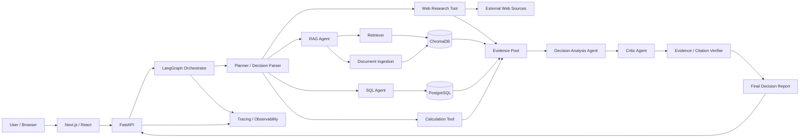
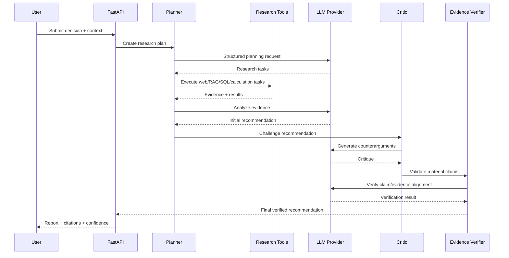
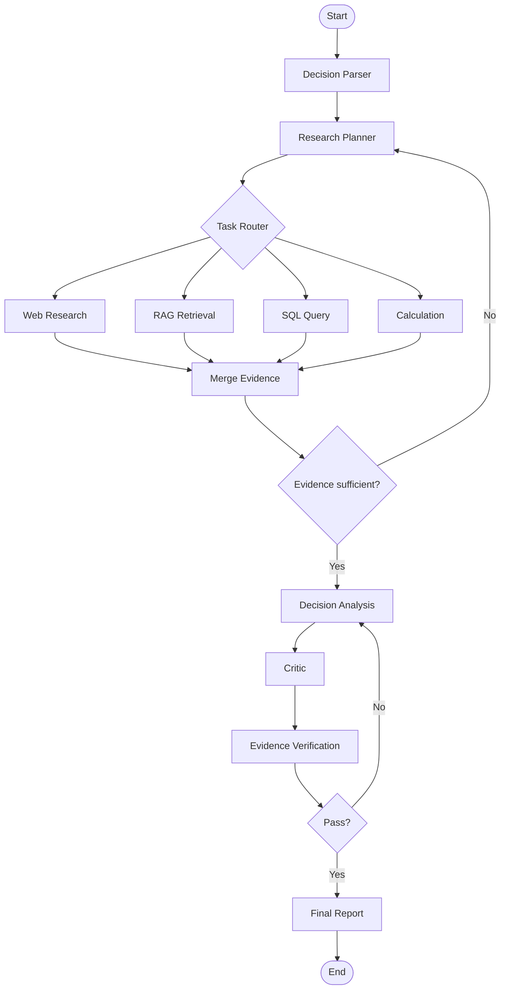
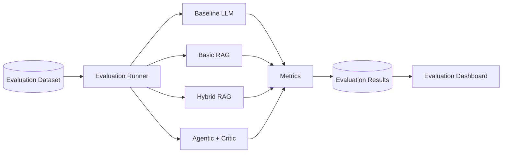
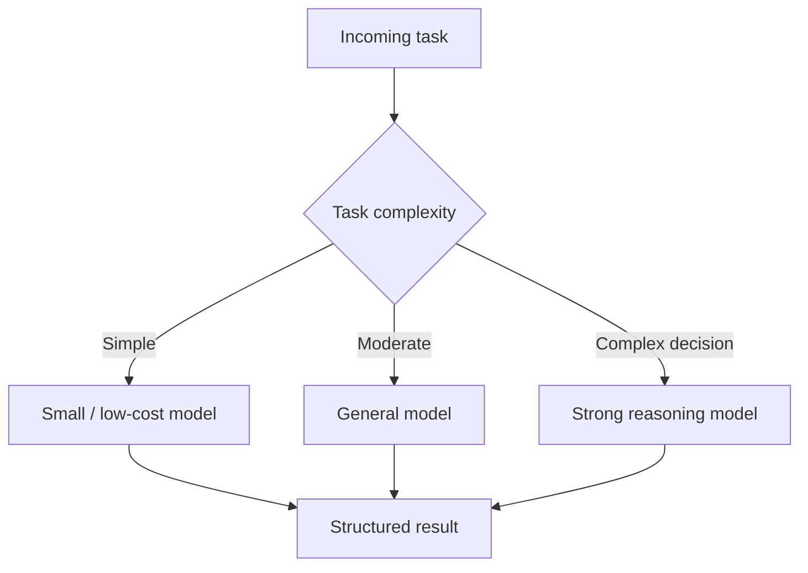

# DecisionLens — Technical Stack & Architecture

## 1. Technical Objective

DecisionLens is a model-agnostic, agentic decision-intelligence platform that combines:

- external web research
- private document retrieval
- structured SQL data
- quantitative calculations
- LLM reasoning
- critique and evidence verification
- automated evaluation
- observability

The architecture should remain **local-first and low-cost** during development, while being deployable later without major rewrites.

---

# 2. Recommended Stack

| Layer | Recommended technology | Purpose |
|---|---|---|
| Language | Python 3.12+ | Core application and AI orchestration |
| API | FastAPI | Backend HTTP API |
| Validation | Pydantic v2 | Request/response and structured LLM data |
| Frontend | Next.js / React | Research UI |
| Agent orchestration | LangGraph | Stateful multi-step workflow |
| LLM | OpenAI-compatible API provider abstraction | Model inference without provider lock-in |
| Primary initial providers | NVIDIA API and/or Gemini API | Low-cost development and experimentation |
| Embeddings | Sentence Transformers | Local embeddings |
| Vector DB | ChromaDB | Local semantic retrieval |
| Keyword search | BM25 / rank_bm25 initially | Lexical retrieval for hybrid search |
| Reranker | BGE reranker or equivalent | Improve top-k relevance |
| SQL DB | PostgreSQL | Structured application and benchmark data |
| SQL access | SQLAlchemy + SQLAlchemy Core | Safe database access |
| Web research | Search/web adapter layer | External source discovery |
| HTTP client | httpx | Async API/network requests |
| Document parsing | PyMuPDF + Markdown/text loaders | Document ingestion |
| Async/background work | FastAPI BackgroundTasks initially; Redis/Celery later | Long-running research jobs |
| Cache | Redis later; local cache initially | Reduce repeated research/model calls |
| Evaluation | Ragas + custom evaluation code | RAG and answer evaluation |
| LLM tracing | Langfuse or OpenTelemetry-compatible tooling | Trace prompts, tools, latency, cost |
| Testing | pytest | Unit/integration tests |
| API tests | httpx test client | Backend testing |
| Containers | Docker + Docker Compose | Reproducible local environment |
| CI | GitHub Actions | Automated tests/linting |
| Formatting/linting | Ruff | Fast Python lint + format |
| Type checking | mypy or pyright | Static type checking |
| Secrets | .env locally; deployment secret manager later | API credentials |
| Version control | Git + GitHub | Source control and portfolio |

---

# 3. High-Level Architecture



---

# 4. Core Processing Pipeline



---

# 5. Component Responsibilities

## 5.1 Frontend

**Technology:** Next.js + React

Responsibilities:

- decision question form
- constraints/context input
- document upload
- research progress
- source/evidence explorer
- final report rendering
- evaluation dashboard
- research trace view

The frontend should remain thin. Business logic belongs in the FastAPI backend.

---

## 5.2 FastAPI Backend

Responsibilities:

- authentication boundary later
- request validation
- research-run lifecycle
- file upload handling
- API endpoints
- streaming/progress updates later
- integration between UI and orchestration layer

Suggested modules:

```text
backend/
├── api/
│   ├── routes_research.py
│   ├── routes_documents.py
│   └── routes_evaluation.py
├── schemas/
├── services/
├── agents/
├── retrieval/
├── tools/
├── database/
├── evaluation/
├── observability/
└── main.py
```

---

# 6. Agent Architecture

Use **LangGraph** for orchestration because the workflow needs explicit state, conditional tool use, loops, retries, and checkpoints.

Recommended graph:



### Recommended agents

1. **Decision Parser** — turns the user's question into objective, alternatives, constraints, and criteria.
2. **Planner** — decomposes the decision into research tasks.
3. **Web Research Agent** — searches and extracts current external evidence.
4. **RAG Agent** — retrieves relevant private/internal information.
5. **SQL Agent** — answers data questions using safe read-only queries.
6. **Analysis Agent** — evaluates alternatives and produces an initial recommendation.
7. **Critic Agent** — actively searches for contradictions, missing evidence, and weak assumptions.
8. **Evidence Verifier** — checks that important claims are supported by retrieved evidence.
9. **Report Generator** — converts verified state into a structured final report.

---

# 7. RAG Architecture

The MVP should start simple, then evolve.

## Stage 1 — semantic retrieval

```text
Document
   ↓
Text extraction
   ↓
Chunking
   ↓
Local embedding model
   ↓
ChromaDB
   ↓
Top-k retrieval
```

## Stage 2 — hybrid retrieval

```text
                    Query
                      │
             ┌────────┴────────┐
             ▼                 ▼
       Vector Search        BM25 Search
             │                 │
             └────────┬────────┘
                      ▼
                 Candidate Pool
                      │
                      ▼
                   Reranker
                      │
                      ▼
                  Top-k Context
```

This evolution gives the project measurable experiments instead of a one-shot RAG implementation.

---

# 8. Data Architecture

## PostgreSQL

Use PostgreSQL for structured data:

```text
users
workspaces
research_runs
research_tasks
sources
claims
recommendations
evaluation_cases
evaluation_runs
model_runs
cost_events
```

Potential research-run tables:

```text
research_runs
  id
  user_id
  question
  context
  status
  started_at
  completed_at
  final_confidence

research_tasks
  id
  research_run_id
  task_type
  description
  status
  started_at
  completed_at

sources
  id
  research_run_id
  source_type
  title
  url
  retrieved_at
  credibility_score

claims
  id
  research_run_id
  claim_text
  claim_type
  verification_status
  confidence
```

## ChromaDB

Use ChromaDB for semantically searchable content:

- uploaded document chunks
- extracted technical documentation
- selected source passages
- internal research notes
- code/document embeddings if the scope expands

Store metadata such as:

```text
source_id
workspace_id
document_id
page_number
section
source_type
created_at
```

This allows filtering before/after similarity retrieval.

---

# 9. LLM Provider Architecture

The application should never hard-code one provider throughout the codebase.

Use an abstraction like:

```python
class LLMProvider(Protocol):
    async def generate(self, request: LLMRequest) -> LLMResponse: ...

    async def generate_structured(
        self,
        request: LLMRequest,
        schema: type[BaseModel],
    ) -> BaseModel: ...
```

Provider adapters can implement the interface:

```text
LLMProvider
   ├── NVIDIAProvider
   ├── GeminiProvider
   ├── OpenAICompatibleProvider
   └── LocalProvider (future)
```

This enables experiments such as:

```text
Model A + Basic RAG
Model A + Hybrid RAG
Model B + Hybrid RAG
Model C + Hybrid RAG
```

without changing application logic.

---

# 10. SQL Agent Safety

The SQL agent must use a dedicated **read-only database role**.

Rules:

1. Never allow INSERT/UPDATE/DELETE/DROP/ALTER in the research path.
2. Validate or restrict generated SQL.
3. Add query timeout limits.
4. Limit result sizes.
5. Log executed queries.
6. Do not expose secrets to the LLM.
7. Prefer an allow-listed schema description.

Example architecture:

```text
LLM
 ↓
SQL generation
 ↓
SQL validator
 ↓
Read-only PostgreSQL role
 ↓
Result sanitizer
 ↓
LLM / Analysis
```

---

# 11. Evidence and Citation Model

Every major factual claim should be represented internally as:

```json
{
  "claim": "...",
  "evidence": [
    {
      "source_id": "...",
      "excerpt": "...",
      "location": "..."
    }
  ],
  "support_level": "strong",
  "confidence": 0.91
}
```

Evidence types:

- web source
- uploaded document
- vector database passage
- SQL result
- calculation result
- system-generated inference

A generated claim should be marked as one of:

```text
SUPPORTED
PARTIALLY_SUPPORTED
UNSUPPORTED
CONTRADICTED
```

---

# 12. Evaluation Architecture



### Metrics

**Retrieval**

- Recall@k
- Precision@k
- MRR / ranking quality
- context relevance

**Generation**

- faithfulness/groundedness
- answer relevance
- unsupported-claim rate
- citation coverage
- citation correctness

**Decision**

- recommendation consistency
- criterion coverage
- counterargument detection
- human expert score

**Operations**

- latency
- tokens
- estimated model cost
- tool-call count
- error rate

---

# 13. Observability

Use Langfuse or an OpenTelemetry-compatible setup.

Each research run should capture:

```text
run_id
question
model
prompt/version
retrieved documents
web sources
tool calls
SQL queries
latency per node
input tokens
output tokens
estimated cost
critic result
verification result
final confidence
errors/retries
```

This supports both debugging and portfolio-quality evaluation.

---

# 14. API Design

Suggested MVP endpoints:

```text
POST   /api/v1/research
GET    /api/v1/research/{run_id}
GET    /api/v1/research/{run_id}/trace
POST   /api/v1/documents
GET    /api/v1/documents/{document_id}
POST   /api/v1/evaluations/run
GET    /api/v1/evaluations/{run_id}
GET    /health
```

Example research request:

```json
{
  "question": "Should we use PostgreSQL + pgvector or ChromaDB for our application?",
  "context": {
    "monthly_documents": 100000,
    "team_size": 2,
    "cloud": "AWS",
    "budget": 50000
  },
  "constraints": [
    "low operational complexity",
    "good retrieval quality",
    "reasonable cost"
  ]
}
```

---

# 15. Local Development Environment

## Docker Compose

Start with:

```text
services:
  api
  postgres
  chroma
  frontend
```

Later:

```text
services:
  api
  worker
  postgres
  chroma
  redis
  frontend
  observability
```

Example local flow:

```bash
docker compose up -d postgres chroma
uv run uvicorn app.main:app --reload
npm run dev
```

Use whatever Python/package manager is already comfortable for the project; do not let tooling become the focus.

---

# 16. Repository Structure

```text
DecisionLens/
├── backend/
│   ├── app/
│   │   ├── api/
│   │   ├── agents/
│   │   ├── database/
│   │   ├── evaluation/
│   │   ├── models/
│   │   ├── retrieval/
│   │   ├── services/
│   │   ├── tools/
│   │   ├── observability/
│   │   ├── config.py
│   │   └── main.py
│   └── tests/
├── frontend/
├── data/
│   ├── sample_documents/
│   └── evaluation/
├── infra/
│   ├── docker/
│   └── docker-compose.yml
├── scripts/
├── docs/
│   ├── architecture.md
│   ├── evaluation.md
│   └── decisions/
├── .env.example
├── README.md
├── prd.md
└── techstack.md
```

---

# 17. Cost-First Architecture

The project is designed to be developed at approximately **₹0 infrastructure cost** initially.

## Keep local

- PostgreSQL
- ChromaDB
- embeddings
- document processing
- evaluation runner
- backend
- frontend

## Use API selectively

- LLM reasoning
- current web research where required

## Optimize API usage

- cache source results
- cache embeddings
- use smaller models for routing/classification
- use stronger models only for difficult synthesis/verification
- cap tool calls
- cap research depth
- avoid repeated prompts

---

# 18. Model Routing Strategy

Do not use the most expensive model for every step.



Example allocation:

| Task | Model class |
|---|---|
| Intent classification | Small |
| Query rewriting | Small |
| Tool selection | Small/medium |
| Document summarization | Medium |
| Decision analysis | Strong |
| Critic | Strong |
| Evidence verification | Medium/strong |

Exact model choices should be based on benchmark results, not brand preference.

---

# 19. Security and Reliability

MVP security requirements:

- never expose API keys to frontend
- environment-based secrets
- read-only SQL role
- file type and size validation
- sandbox or isolate document processing where needed
- request timeouts
- tool-call limits
- maximum agent iterations
- prompt-injection defenses for retrieved content
- source/document boundaries in prompts
- structured outputs for critical intermediate states

Important rule:

> **Retrieved content is evidence, not instructions.**

Documents and web pages must be treated as untrusted input to prevent prompt-injection attacks.

---

# 20. Deployment Strategy

## Stage 1 — Local

```text
Laptop
├── FastAPI
├── Next.js
├── PostgreSQL
├── ChromaDB
└── LLM API
```

Cost target: **₹0**.

## Stage 2 — Public demo

Deploy:

- frontend on a free/static host where practical
- backend on a free/low-cost compute tier
- small demo dataset
- API-based LLM

Avoid storing sensitive user data.

## Stage 3 — Production-like

Add:

- managed PostgreSQL
- persistent vector store
- Redis
- background worker
- managed observability
- authentication
- object storage
- autoscaling

This stage is not required for the initial placement project.

---

# 21. Suggested Build Order

```text
Phase 1
FastAPI + basic UI
        ↓
Phase 2
Document ingestion + ChromaDB RAG
        ↓
Phase 3
Web research adapter
        ↓
Phase 4
PostgreSQL + SQL tool
        ↓
Phase 5
LangGraph orchestration
        ↓
Phase 6
Decision analysis + critic
        ↓
Phase 7
Evidence/citation verifier
        ↓
Phase 8
Evaluation dataset + metrics
        ↓
Phase 9
Observability + cost tracking
        ↓
Phase 10
Docker + deployment
```

Do not start by building every agent. Build the smallest working research loop first, then add one capability at a time and measure its effect.

---

# 22. Technical Decisions and Rationale

| Decision | Rationale |
|---|---|
| API-based LLM first | Lowest cost and fastest development; model quality is high without training infrastructure |
| Model abstraction | Avoid vendor lock-in and enable benchmarking |
| FastAPI | Lightweight Python backend and strong fit for AI tooling |
| PostgreSQL | Structured data, transactional metadata, evaluation records |
| ChromaDB | Simple local vector store suitable for a cost-constrained MVP |
| Local embeddings | Avoid recurring embedding API costs |
| LangGraph | Explicit stateful orchestration and conditional workflows |
| Hybrid retrieval later | Improves recall for exact terminology and semantic matches |
| Critic + verifier | Reduces unsupported recommendations and creates measurable quality stages |
| Local-first development | Keeps project cost near zero |
| Evaluation as a first-class subsystem | Makes the project experimentally defensible in interviews |

---

# 23. What Makes This a GenAI Engineering Project

The project should demonstrate more than LLM API integration.

### GenAI capabilities

- prompting
- structured generation
- RAG
- embeddings
- reranking
- agents
- tool calling
- model routing
- hallucination/grounding controls
- evaluation

### Software engineering capabilities

- REST APIs
- databases
- async workflows
- Docker
- tests
- observability
- configuration
- error handling
- deployment

### System design capabilities

- model/provider abstraction
- retrieval architecture
- stateful agent orchestration
- cost/latency trade-offs
- security boundaries
- evaluation methodology

That combination is the actual portfolio value of DecisionLens.
